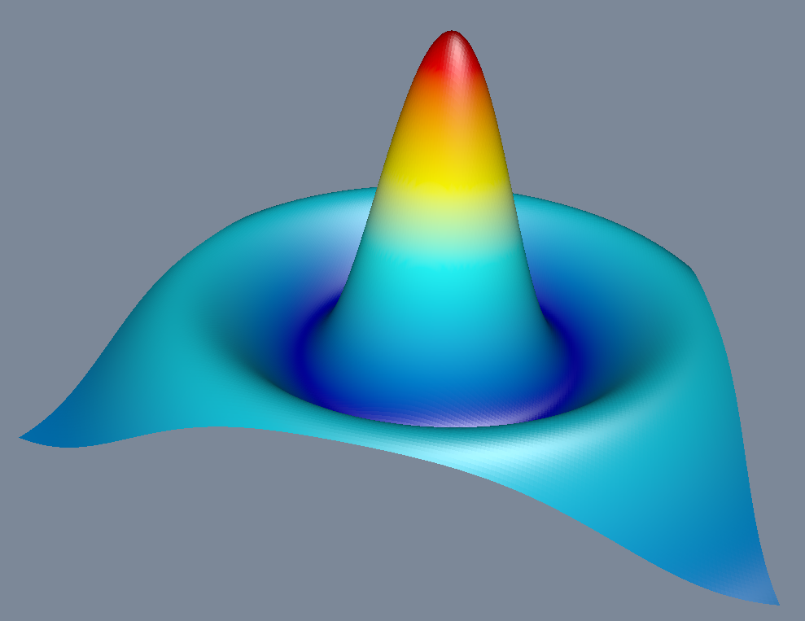
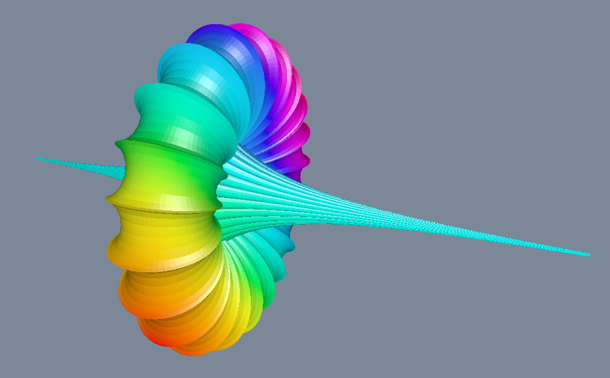

+++
title = "Dev Log - 0003"
date = 2023-05-07
draft = false
[taxonomies]
tags=["logs", "programming", "graphics"]
[extra]
toc=true
+++

# Progress on Graphics Programming with `wgpu`

This week, I delved further into the world of 3D visualization with `wgpu`. The
chapter I was able to tackle this week was about the visualization of 3D
surfaces. The theory in that chapter was not too challenging. The new stuff
that was addressed there were color schemes and how to interpolate between
colors, the creation of colored 3D meshes for arbitrary 3D functions with quads
and the handling of these with relation to the light.

Although it was not challenging in theory, it's always fun to implement this
and build it into the bigger project I'm currently growing based on the book.
An example of this is the light, which needed adjustments. Since the light
basically just consists of data we're sending to the GPU I was able to abstract
it with a trait that is based on the shader which is in use. Squeezing in the
new functionality is always a good learning experience!

Overall, I'm quite pleased with the end result. It's amazing to see how such
complex structures can be created by literally just changing a 3D math function
now.

# Teaching a friend

In addition to my own programming adventures, I also started teaching a friend
Rust this week on wednesday and thursday. It was quite fun to introduce someone
to a language that I've grown to love. We started off with the basics -
variables, if conditions, functions, and data structures.

I found that explaining concepts to someone else was a great way to reinforce
my own understanding of them. It was also interesting to see how my friend
approached problems and came up with solutions. We worked on a few small
toy problems together, which was a lot of fun.

Teaching someone programming is a great way to share knowledge and build a
sense of community. I'm looking forward to continuing our lessons and seeing
where it takes us. Who knows, maybe my friend will end up becoming a Rust
expert someday!
