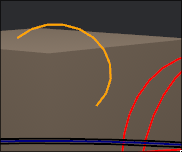
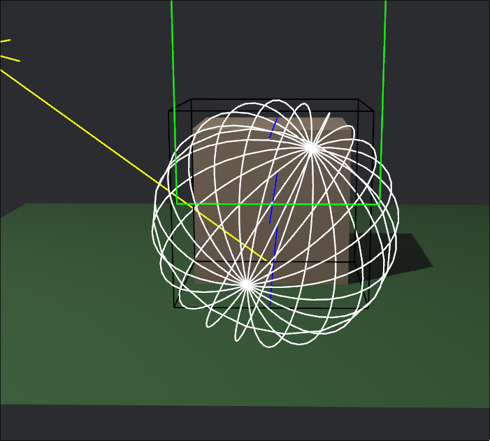
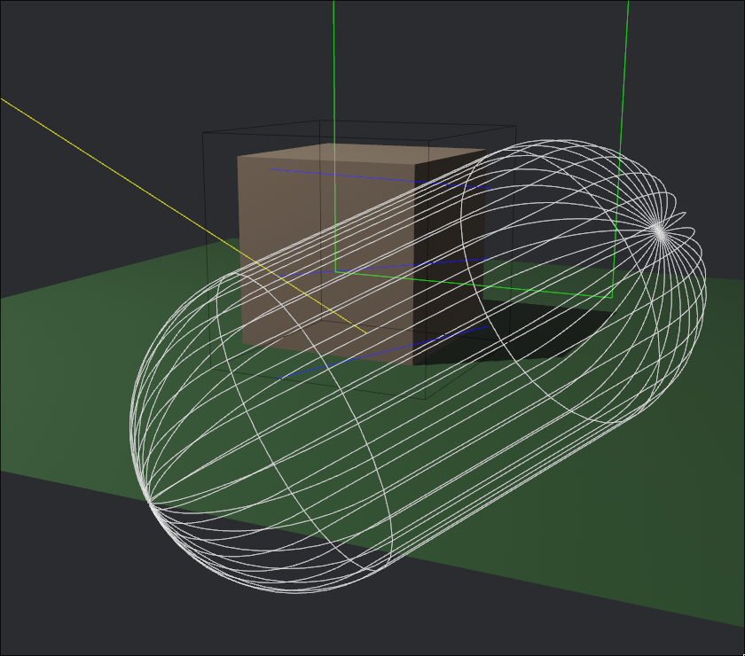
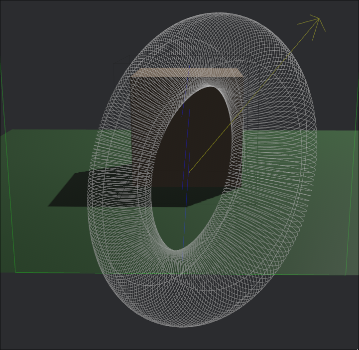

+++
title = "Dev Log - 0014"
date = 2024-01-25
draft = true
[taxonomies]
tags=["rust", "bevy", "gizmo", "arc"]
[extra]
toc=true
+++

# Progress on the bevy front

Through a series of very cool events, I was finally able to finish up the bevy
primitives gizmo PR. To be honest, it wasn't my merit at all. A thousand thanks
go out to my dear friend noth who was the one who lifted my blind folds and
helped me to cross the finish line. In the end it wasn't as complicated as I
initially thought it would be. The solution included the removal of one of two
lifetimes. I felt a bit stupid after finding that out but that was overshadowed
by the pure happiness I felt when I know this PR would be in the reviewing
phase soon. So I spend the next day cleaning up that PR, added docs to it,
added examples to it and so on. 

A big chunk was actually splitting it up into two orthogonal PRs since I needed
to implement 3D arcs for convenience while drawing round shapes. Since they
weren't there before we could nicely split that up. As it turned out my initial
implementation which followed the Unity API was not that handy and had some
flaws. So I spent some time fixing it with a custom made solution. In the end I
was also able to implement another smooth arc method which made me even
happier. After all I'm pretty satisfied with all of the code in this PR.

I noticed that all of my blog posts with pictures were much more enjoyable to
myself. So I'm just gonna add some here as well. Be ready for a few random
pictures here and there.

