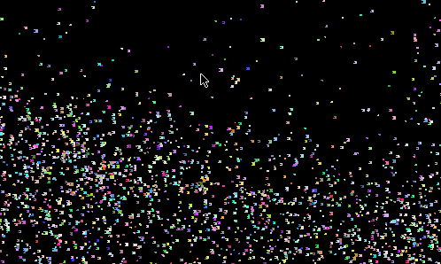

+++
title = "Dev Log - 004"
date = 2023-05-14
draft = false
[taxonomies]
tags=["logs", "programming", "graphics"]
[extra]
toc=true
+++

# Progress on Graphics Programming with `wgpu`

Over the last week I read quite a few chapters of the `wgpu` book and I'm close to finishing it. The week started with a chapter about texturing. Pretty basic stuff considering I had to do with it already about one year ago. There was nothing to surprising there and I ended up mapping a few funny images onto a cube and a sphere.

The next chapter was pretty boring, so I skipped it completely. It was about 3D surface charts. Essentially it was a combination of rendering a 3D surface and a 3D wireframe of the functions I already rendered 🥱

And then came chapter 12, the chapter about "Rendering multiple things". It was the chapter I started reading the book for. It described some of the most common techniques to render multiple separate objects on the GPU. These techniques include, but are not limited to:

- Rendering the same mesh with different bind groups (e.g. different uniform buffers)
- Instancing, that is: Rendering the same vertices (vertices doesn't necessarily mean positional attributes) multiple times while stepping through some other "instanced" data that is accessed via an instance index
- Rendering with multiple vertex buffers
- Rendering with multiple render pipelines
- Rendering with multiple render passes

This chapter was short, sweet and very insightful. Cool stuff and I hope I'll be able to use it soonish.

At the end of the week I was even able to squeeze in another chapter about compute shaders. It's an interesting topic considering that we'll be soon able to use these for certain tasks in the browser when WebGPU is fully supported. Overall, I mainly copy-pasted the code from the chapter and went through it to understand it. Even though I just copy-pasted everything there, it was still quite a learning experience since I had to fix up a lot of old code from the book that was deprecated by now. The main insight there is to be careful with alignment issues when transfering data to the GPU! Here are some pictures of the copute shader programs.

# First experiments with bevy render pipelines

Since I'm finally reaching the end of the `wgpu` book and I'm feeling kind of safe on the whole low-ish level graphics API stuff, I finally started to toy around with the bevy render pipeline. This mainly included a few small experiments with the bevy render graph and its API. These experiments just included things like printing when a node runs and working out how the slots of a node work exactly. Overall everything there was pretty intuitive and the documentation made any stuff that was still unclear pretty easy to understand.

I think I'm ready to start some actual rendering experiments which deviate from the high level graphics API in bevy.

# Task Warrior

I discovered the CLI tool task warrior and I'm pretty happy with it. A lot of the productivity I expericened last week probably came from it! The fact I like the most about it is that you can define multiple contexts to organize tasks and that tasks can be put on a waiting list so that they will only appear once their waiting time is over. That helps a lot with my usual problem of todo lists which grow to fast or todo lists which are missing long term memory items because they would grow to fast otherwise. I'm looking forward to using the tool more intensively and looking at all the cool burndown charts it produces! 

# NixOS improvements and cleanups

This week I tackled a lot of things on my system. I finally set up my emails properly (don't know why I even dealt with emails manually before). I went for good old thunderbird since I wasn't really feeling "spending the time to learn neomutt" (yet ?).

Other than that I worked on improving my clipboard and rofi experience. I'm now using greenclip as a clipboard manager since it has some (easy to use) integrations with rofi. Rofi got some new shortcuts for selecting emojis 😅 and for pasting out stuff from the non-system clipboards now aswell as a new theme. I think my initial rofi theme was back from the day I set this machine up and it didn't get any catpuccin theme love ever since. Now it integrates much nicer in my general setup.

Finally I spent a bit more time on using my GPG key in more places. I'm not auto signing my commits with it and imported the public key in github (not sure what this does tbh now that I think of it).

# Majesty and Music

I rediscovered the soundtrack of an old game I played when I was younger. Now here is me trying to cover-compose the music in MuseScore again. Ohh boy, good times ... 🎶
