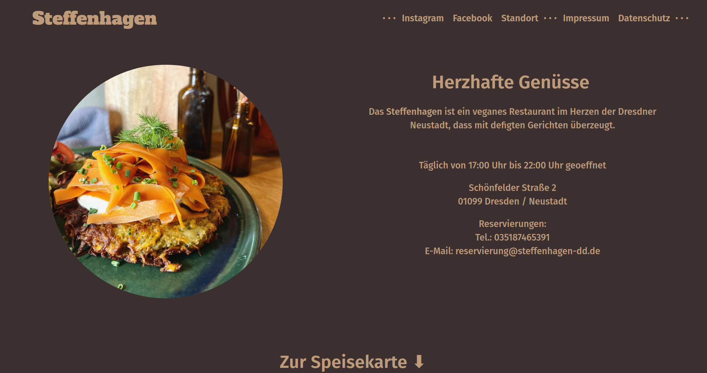
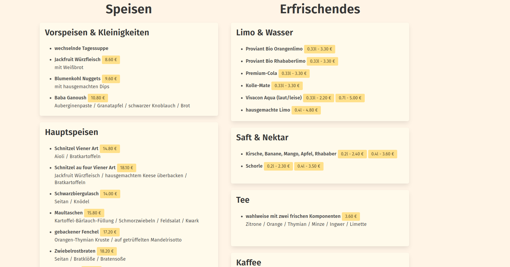
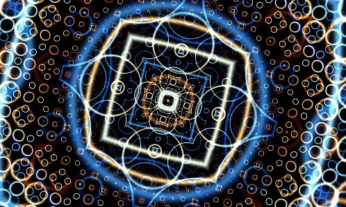

+++
title = "Dev Log - 008"
date = 2023-06-12
draft = false
[taxonomies]
tags=["nixos", "shader", "web", "leptos"]
[extra]
toc=true
+++

# Additional Updates to NixOS

This week I finally completed my NixOS styling config by applying a fitting theme to my `starship` prompt. Of course I used my beloved [catppuccin theme](https://github.com/catppuccin/catppuccin). Now all my color themes finally start fitting together.

# Experiments with `leptos` + `axum`

Since I had some spare time and I'm currently lacking something new to learn I started investigating the web-app world of Rust a bit further. For this I took a rough look at `axum` web framework and the `leptos` framework for building web apps. It took me some time to figure out how to build and run the example apps but it looks promising. I like the way leptos handles reactivity and I might try it out this year a bit further. `axum` also seems pretty interesting on its own and I might try to write a little service with it to host it on my server.

# Website of Steffenhagen with `zola`

I really like a local restaurant in my neighbourhood called Steffenhagen. Shoutout to them! Their web appearance seemed a bit out of date and I felt creative this week so I just sat down for one afternoon and glued some extra content and CSS to an existing `zola` theme to create this beauty here. I mailed them and offered them the website for free. Let's see if they reply 🙈




# Shadertoy

While browsing the web, I found a neat little video showcasing some shader stuff on the shadertoy website. I really loved the visuals and also shader coding in general. So I took some time to give the example from the video my own spin (literally lol). Here's the result.



And here is the code. (Warning, might be flashy!)

```glsl
const float rep_val = 17.0;
const float num_iter = 4.0;
const float asymetric_uv = 1.6;
const float flash_time = 0.7;
const float rotate_time = 0.1;
const float dist_time = 0.07;
const float zoom_time = 0.1;


vec3 palette(float t) {
    float st = sin(t) * 2.0 - 1.0;
    float ct = cos(t) * 2.0 - 1.0;
    vec3 a = vec3(0.5, 0.5, 0.5);
    vec3 b = vec3(0.5, 0.5, 0.5);
    vec3 c = vec3(.75, .75, .75);
    vec3 d = vec3(0.7, 0.6, 0.5);
    return a + b * cos(2.0 * 3.1415 * (c*t+d));
}

vec2 rotate(vec2 v, float a) {
	float s = sin(a);
	float c = cos(a);
	mat2 m = mat2(c, -s, s, c);
	return m * v;
}


vec3 iter_once(vec2 uv, vec2 uvo, float i) {
    float dist_mid_o = length(uvo);
    float dist_mid = length(uv) * exp(-dist_mid_o);
    vec3 color = palette(iTime * i * flash_time + dist_mid_o);
    dist_mid = dist_mid + iTime * dist_time;
    dist_mid = sin(dist_mid * rep_val) / rep_val;
    dist_mid = abs(dist_mid);
    float damp_val = pow(num_iter, 4.0) * 100.0;
    dist_mid = exp(-(dist_mid * dist_mid) * damp_val);
    return color * vec3(dist_mid);
}

void mainImage( out vec4 fragColor, in vec2 fragCoord )
{
    vec2 uvo = (fragCoord * 2.0 - iResolution.xy) / iResolution.y;
    uvo = rotate(uvo / abs(sin(iTime * zoom_time) * 0.5 + 1.0), iTime * rotate_time);
    vec2 uv = uvo;
    vec2 uv2 = uvo * 0.1;
    vec3 final_color = vec3(0.0);


    for(float i = 0.0; i < num_iter; i++) {
        uv = fract(uv* asymetric_uv) - 0.5;
        uv2 = fract(uv2 * asymetric_uv) - 0.5;
        final_color += iter_once(uv, uvo, i) + iter_once(uv2, uvo * 0.5, i);
    }
    // Output to screen
    fragColor = vec4(final_color, 1.0);
}
```

# Exercism Haskell (argh)

Yesterday I was finally in the mood for some more Haskell again. So I started to solve some more exercises on Exercism. The problems were not interesting enough to mention them here and in the end I solved two, but boy this was a ride. The problems themselves weren't the problem but rather compiling Haskell code on NixOS. I tried out several approaches:

- stack2nix (didn't work, it's broken)
- cabal2nix (didn't work, ghc version issue)
- cabal2nix 2nd try (didn't work, ghc version ok now to compile but LSP didn't like the ghc version)
- cabal2nix 3rd try (didn't work with any ghc version I tried out from `nixpkgs`. Either LSP or compilation via `cabal` failed)
- just try out vanilla `cabal build` -> works (?!)

As you can guess, I was pretty tired and confused after all of this. The solution was basically to do a `cabal init` on an already existing project which was made to work with `stack` (which doesn't work for me at all). After that some files need to be renamed and moved and then it finally works 🎉

I'll probably do some more Haskell problem solving in the coming weeks since I feel very refreshed after those small Haskell sessions.
