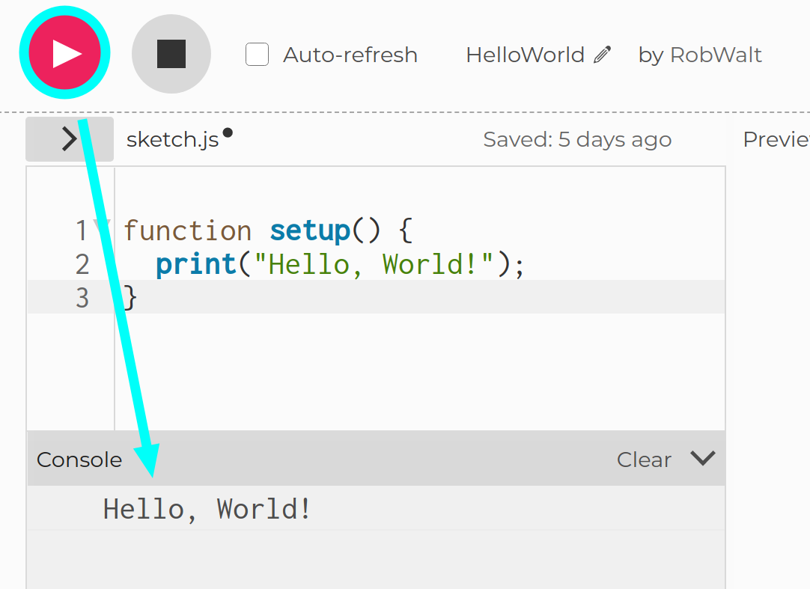

+++
title = "St. Benno Gymnasium Dresden SAW 2023"
date = 2023-04-17
draft = false
[taxonomies]
tags=["voluntary", "school", "teaching", "p5js"]
[extra]
toc=true
+++

<!-- Abstraction is hard, Be concrete first -->

# Einführung in die Programmierung

##  Was ist Programmierung?

Stell dir vor, du bist der Regisseur eines Films. Du hast eine großartige Idee
für eine Filmszene. Überasschenderweise bekommst die einmalige Chance deine
Szene zu verfilmen. Jetzt musst du all die Dinge planen, die passieren werden -
wann die Schauspieler sprechen, wie sie sich bewegen, welche Emotionen sie
darstellen und so weiter.

Programmieren ist ähnlich wie Regie führen, aber anstatt Schauspieler zu
benutzen, nutzt du Computer. Wie bei einem Film benötigst du auch beim
Programmieren eine Menge Planung und Vorbereitung. Du musst darüber nachdenken,
welche Dinge der Computer tun soll, in welcher Reihenfolge er sie tun soll und
wie er sie tun soll. Wenn du all diese Anweisungen geschrieben hast, kann der
Computer sie ausführen und deine Idee in die Tat umsetzen.

Ein einfaches Beispiel für eine Aufgabe, die wir dem Computer geben können, ist das
Addieren von zwei Zahlen. Die konkreten Anweisungen unserer Anleitung für den
Computer wären dann:

1. Speichere in `zahl1` den Wert `5`
2. Speichere in `zahl2` den Wert `3`
3. Speichere in `summe` die Summe von `zahl1` und `zahl2`

Hier ist ein Beispiel, wie das in JavaScript aussehen könnte:

```js 
let zahl1 = 5;
let zahl2 = 3;
let summe = zahl1 + zahl2;
```

##  Warum ist Programmieren wichtig?

Programmierung ist wichtig, weil sie uns hilft, Computer und andere
elektronische Geräte zu steuern und ihnen zu sagen, was sie tun sollen. Ohne
Programmierung könnten wir nicht die vielen nützlichen Dinge tun, die wir heute
mit Computern und anderen Geräten tun können, wie z.B. das Kommunizieren durch Apps,
das Spielen von Videospielen oder das Einkaufen in Online Shops.

Darüber hinaus ist Programmierung auch in vielen Wissenschaften wichtig. Dort wird
sie beispielsweise für Simulationen und Datenanalyse verwendet. Hier sind einige
Beispiele aus Medizin, Biologie und Physik:

- In der Medizin kann Programmierung verwendet werden, um die Diagnose und
Behandlung von Krankheiten zu verbessern. Beispielsweise können Programme zur
Bildverarbeitung verwendet werden, um medizinische Bilder wie CT-Scans und
MRI-Scans zu analysieren und genaue Diagnosen zu erstellen. Programme können
auch bei der Entwicklung von Medikamenten und Therapien helfen, indem sie die
Wechselwirkungen zwischen Arzneimitteln und biologischen Systemen simulieren.
- In der Biologie kann Programmierung verwendet werden, um komplexe biologische
Prozesse zu simulieren und zu modellieren. Mit Programmen können Forscher
beispielsweise das Wachstum von Zellen und Organismen verstehen oder das
Verhalten von Viren und Bakterien untersuchen. Programmierung kann auch in der
Genetik eingesetzt werden, um genetische Daten zu analysieren und Muster in
DNA-Sequenzen zu erkennen.
- In der Physik kann Programmierung verwendet werden, um komplexe mathematische
Modelle zu erstellen und Simulationen durchzuführen. Mit Programmen können
Forscher beispielsweise das Verhalten von Teilchen in Atomkernen simulieren
oder die Bewegungen von Sternen und Galaxien im Universum untersuchen.
Programmierung kann auch bei der Entwicklung von fortschrittlichen Technologien
wie Raumfahrtantrieben und Robotiksystemen eingesetzt werden.

Insgesamt kann Programmierung uns also dabei helfen, komplexe Probleme zu
lösen, die Welt um uns herum besser zu verstehen und viele Dinge in unserem
Leben einfacher zu machen.

# Die ersten Schritte in der Programmierung

## Was ist p5.js ?

`p5.js` ist ein Programmiergrundgerüst in Javascript, das uns ermöglicht,
coole und interaktive Kunst- und Designprojekte zu erstellen. Mit `p5.js`
kannst du Formen, Farben und Bewegungen auf dem Bildschirm erstellen und sogar
mit der Maus oder der Tastatur interagieren. Es ist eine großartige
Möglichkeit, deine Kreativität und deine Programmier-Fähigkeiten zu entwickeln.

##  Ausführen des ersten Programms (Hello, World!)

Wir schreiben nun ein "Hello, World!" - Programm. "Hello, World!" ist ein
kleines Programm, das oft als erstes Programm geschrieben wird, wenn man eine
neue Programmiersprache lernt. Der Zweck des Programms ist es, sicherzustellen,
dass alles richtig eingerichtet ist und funktioniert. Das Programm tut nichts
Besonderes - es gibt einfach nur den Text "Hello World" auf dem Bildschirm aus.

Klicke auf den Link um das "Hello, World!" Programm zu testen!

[Hello, World!](https://editor.p5js.org/RobWalt/sketches/oi31W8JNZ)

Wenn du den `Play-Button` gedrückt hast, sollte die Nachricht "Hello, World!"
in der Konsole zu sehen sein, wie im folgenden Bild.



#  Was sind Variablen?

## Analogie

Stell dir vor, du hast mehrere Brotbüchsen, die du mit verschiedenen Dingen
füllen kannst, wie z.B. Butterbrote, Obst oder Kekse. Jede Brotbüchse hat einen
Aufkleber mit einem eigenen Namen, damit du weißt, was drin ist. Zum Beispiel
könntest du eine Brotbüchse namens "Butterbrot" haben, in der du immer dein
Butterbrot für die Schule aufbewahrst oder eine Brotbüchse "Lieblingskekse" in
der du die besten Kekse der Welt aufbewahrst.

In der Programmierung ist eine Variable ähnlich wie eine dieser Brotbüchsen. Du
kannst eine Variable erstellen und ihr einen Namen geben, um einen Wert zu
speichern, den du später im Programm verwenden kannst. Wenn du z.B. eine
Variable "Alter" erstellst, kannst du ihr einen Wert wie "10" zuweisen und
später im Programm auf den Wert zugreifen, um Berechnungen durchzuführen
oder Entscheidungen zu treffen.

## Nutzen in der Programmierung

Nun könnte man natürlich fragen: "Warum braucht man Variablen"? Dafür gibt
es hier ein einfaches Beispiel:

Nehmen wir an, du willst ein Programm schreiben, in dem du ausrechnen willst, wie
lange du insgesamt brauchst um eine bestimmt Bestellung an unterschiedlichsten
Kuchen zu backen. Du weisst, dass dein bester Kuchen 40min im Ofen braucht
und du bekommst folgende Liste an Bestellungen:

- 1 Kuchen für den Bürgermeister
- 5 Kuchen für die Feuerwehr
- 3 Kuchen für die Familie vom Bäcker selbst

Also überlegst du dir in welchen Schritten der Computer die Gesamtbackdauer
ausrechnen kann und kommst auf folgende Anleitung. :

- `1 * 40min =  40min`
- `5 * 40min = 200min`
- `3 * 40min = 120min`
- Insgesamt `40min + 200min + 120min = 360min`

Nun bist du aber ziemlich erfinderisch und erstellst ein neues Rezept, das noch
besser schmecken soll als dein letzter bester Kuchen. Das neue Rezept benötigt
aber 45min im Ofen. Du bekommst wieder die selbe Bestellungsliste und willst
die Gesamtbackdauer mit deinem Programm berechnen. Jetzt musst du in allen
Schritten deinen Berechnung die neue Backdauer eintragen:

- `1 * 45min =  45min`
- `5 * 45min = 225min`
- `3 * 45min = 135min`
- Insgesamt `45min + 225min + 135min = 405min`

Anstelle jetzt jedes mal an allen Stellen in deinem Programm die neue Backdauer
anzugeben, kommst du auf die Idee einfach eine Variable für die Backdauer zu
verwenden. Das erspart viel Arbeit. Das neue Programm ist folgendes:

- **`backdauer = 45min`**
- `1 * backdauer min =  45min`
- `5 * backdauer min = 225min`
- `3 * backdauer min = 135min`
- Insgesamt `45min + 225min + 135min = 405min`

Nun musst du nur an einer Stelle Änderungen vornehmen, wenn du ein neues
Kuchenrezept verwenden möchtest.

Wir sehen also: Variablen helfen uns dabei viel mühselige Arbeit zu vermeiden.

## Beispiele

Wenn wir unser Programm aus dem letzten Beispiel in JavaScript übersetzen
würden, dann sähe das in etwa so hier aus:

```js
let backdauer = 45

let buergermeister_kuchen = 1 * backdauer
let feuerwehr_kuchen = 5 * backdauer
let baecker_kuchen = 3 * backdauer

let gesamt_back_dauer = buergermeister_kuchen + feuerwehr_kuchen + baecker_kuchen

print("Die Gesamtbackdauer ist: " + gesamt_back_dauer + "min")
```

In diesem Beispiel sehen wir auch, dass wir die Zwischenergebnisse in Variablen
speichern. Das ist die Art und Weise, wie wir dem Computer sagen können, dass
er sich etwas merken soll. Würden wir einfach nur die Backdauer der einzelnen
Kuchen so hier ausrechnen:

```js
1 * backdauer
5 * backdauer
3 * backdauer
```

dann würde der Computer die Ergebnisse sofort wieder vergessen und wir
könnten sie auch nicht weiter verwenden.

Noch ein Hinweis: Die Variablen Namen oben nutzen Unterstriche in den Namen
(`buergermeister_kuchen`), da es nicht erlaubt ist Leerzeichen in
Variablennamen zu verwenden.

## Selbst ausprobieren

[Variablen](https://editor.p5js.org/RobWalt/sketches/A6Mwj2H11)

Kleine Aufgaben:

1. Ändere die Backdauer des Kuchens und teste, wie sich das Ergebnis ändert
2. Füge noch 4 Kuchen für die Förster zur Liste hinzu
  - Berechne die Backdauer der Försterkuchen
  - Vergiss nicht diese Backdauer auf das Gesamtergbnis zu addieren

# Was sind Bedingungen?

## Analogie

Stell dir vor, du bist in der Küche und möchtest einen Kuchen backen. Bevor du
den Kuchen in den Ofen schiebst, musst du sicherstellen, dass alle
Vorbereitungen zum Backen getroffen wurden. Zum Beispiel musst du
sicherstellen, dass der Ofen auf die richtige Temperatur vorgeheizt ist. Wenn
diese Bedingung erfüllt ist, kannst du den Kuchen in den Ofen schieben und backen.

In der Programmierung ist es ähnlich. Manchmal muss ein Programm sicherstellen,
dass bestimmte Bedingungen erfüllt sind, bevor es eine Aktion ausführt. Zum
Beispiel kann ein Programm eine Bedingung überprüfen, ob eine Variable eine
bestimmte Zahl oder einen bestimmten Text enthält. Wenn diese Bedingung erfüllt
ist, kann das Programm eine Aktion ausführen. Wenn die Bedingung nicht erfüllt
ist, kann das Programm eine andere Aktion ausführen oder einfach weiterlaufen.

## Nutzen in der Programmierung

Hier ist ein kleines konkretes Beispiel, warum Bedingungen in der Programmierung nützlich sind:

Nehmen wir an, du willst ein Programm schreiben, das eine aktuelle Beschreibung
des Wetters in einer Variable speichert und dir basierend darauf eine kleine
Nachricht ausgibt. Das Wetter kann "Sonne", "Regen" oder "Wolken" sein. Alle
anderen Beschreibungen magst du erstmal nicht in deinem Programm nutzen. (Wir
können sie später noch ganz einfach hinzufügen!)

Du überlegst dir wieder Schritte, die der Computer ausführen muss, um die
Aufgabe deines Programms zu erfüllen. Sie lauten wiefolgt:

- Speichere eine Beschreibung des Wetters unter der Variable `wetter` ab, z.B.
  `let wetter = "Sonne"` (Achtung! Bei Text brauchen wir Anführungszeichen,
  sonst denkt der Computer es handelt sich um eine Variable)
- Wenn das `wetter` den Wert `"Sonne"` hat, dann schreibe in die Konsole `"Das
  Wetter ist heute toll!"`.
- Wenn das `wetter` den Wert `"Regen"` hat, dann schreibe in die Konsole `"Es
  regnet!"`.
- Wenn das `wetter` den Wert `"Wolken"` hat, dann schreibe in die Konsole
  `"Heute ist das Wetter langweilig!"`.
- Wenn das `wetter` einen anderen Wert annimmt, dann haben wir einen Fehler und
  sollten das auch nennen. Z.B. `"Banane"` wäre kein zulässiger Wert für
  unser Wetterprogramm. Wenn das der Fall ist, dann schreibe in die Konsole
  `wetter hatte einen unbekannten Wert!`

## Beispiel

Im nächsten Schritt übersetzt du wieder dein Programm in JavaScript code.

```js 
let wetter = "Sonne"

if (wetter == "Sonne") {
  print("Das Wetter ist heute toll!")
} else if (wetter == "Regen") {
  print("Es regnet!")
} else if (wetter == "Wolken") {
  print("Heute ist das Wetter langweilig!")
} else {
  print("wetter hatte einen unbekannten Wert!")
}
```

Hierbei sehen wir:

- Bedingungen werden mit dem Schlüsselwort `if ( ... ) { ... }` eingeleitet
  und prüfen ob der Inhalt der runden Klammern wahr ist
- Wir können testen, ob zwei Werte gleich sind mit `==`, beim code oben zum
  Beispiel in den ersten runden Klammern: `wetter == "Sonne"`
- Wenn sich der Wert in den runden Klammern als wahr herausstellt, dann wird
  der Code in den geschwiften Klammern ausgeführt und der Rest der `if`
  Bedingung wird übersprungen
- Wenn sich der Wert in den runden Klammern jedoch als falsch herausstellt,
  dann wird die nächste Bedingung geprüft
- Wir können für mehrere Bedingungen testen. Die zweite, dritte, usw.
  Bedingung wird mit `else if ( ... ) { ... }` eingeleitet
- Wenn keine Bedingung zutrifft können wir die `if` Bedingung mit `else { ...
  }` beenden. Dann wird der Code aus der letzten geschweiften Klammer
  ausgeführt.

## Selbst ausprobieren

[Bedingungen](https://editor.p5js.org/RobWalt/sketches/jkkZv9LyF)

#  Übungen zur Verwendung von Variablen und Bedingungen

1. Schreibe ein Programm, das den Benutzernamen in einer Variable speichert und
   dann den Nutzer in einer Begrüßungsnachricht auf der Konsole begrüßt. 
  - Tipp: Du kannst Variablen in Text mit `+` einbinden: `"Hallo, " + name`
  - Beispiel Ausgabe: `"Hallo, [Benutzername]! Willkommen in unserer Küche!"`
2. Schreibe ein Programm, das das Gewicht von Zucker und Mehl in zwei separaten
   Variablen abspeichert und dann das Gesamtgewicht der Zutaten auf der
   Webseite anzeigt.
  - Tipp: Teste `text("TestText!", width / 2, height / 2)` und passe es für die Aufgabe an.
  - Beispiel Ausgabe: `"Du hast 1 Kilo Zucker und 2 Kilo Mehl verwendet. Insgesamt hast du 3 Kilo Zutaten!"`
3. Schreibe ein Programm, das das Alter des Benutzers / der Benutzerin in einer Variable
   speichert und dann prüft, ob er/sie alt genug ist, um Kaffee zu trinken.
  - Beispiel Ausgabe: `"Wow, du bist schon [Alter]. Du bist alt genug, um Kaffee zu trinken!"`
4. Schreibe ein Programm, das die Lieblingszahl des Benutzers / der Benutzerin
   in einer Variable abspeichert, diese dann mit einer zufälligen Zahl
   multipliziert. Das Ergebnis gibt dann an, wie viele Stücke Kuchen der Benutzer
   geschenkt bekommt. Gib dieses Ergebnis aus!
  - Tipp: Nutze `random(n)` um eine zufällige Zahl zwischen `0` und `n` zu generieren
  - Beispiel Ausgabe: `"Deine Lieblingszahl ist [Lieblingszahl]. Du bekommst von mir [Anzahl der Stücke] Stücke Kuchen!"`
5. Schreibe ein Programm, das eine Temperatur in Fahrenheit in einer Variable
   abspeichert und dann die Temperatur in Celsius umrechnet und auf der
   Webseite anzeigt. 
  - Tipp: die Formel ist `(fahrenheit - 32) / 1.8 = celsius`. 
  - Beispiel Ausgabe: `"Die Temperatur im Ofen beträgt 350 Grad Fahrenheit? Das entspricht 176 Grad Celsius!"`
6. Schreibe ein Programm, das die Länge und Breite eines Backblechs in zwei
   Variablen speichert und dann die Fläche des Bleches auf der Webseite
   anzeigt.
  - Tipp: Die Fläche des Backblechs können wir mit `hoehe * breite` berechnen
  - Beispiel Ausgabe: `"Das Backblech ist 5cm lang und 3cm breit. Die Fläche beträgt 15cm²!"`
7. Schreibe ein Programm, das den Radius eines Kekses in einer Variable
   abspeichert und dann dessen Umfang und Fläche auf der Webseite anzeigt.
  - Tipp: `PI` ist als feste Variable in p5.js vorgegeben
  - Tipp: die Umfang-Formel ist `umfang = 2 * PI * radius`
  - Tipp: die Flächen-Formel ist `flaeche = PI * radius * radius`
  - Beispiel Ausgabe: `"Der Keks hat einen Radius von 4cm. Der Umfang beträgt 25,13cm und die Fläche beträgt 50,27cm²!"`
8. Extra Aufgabe: Schreibe ein Programm, das eine Anzahl von Minuten in einer Variable
   abspeichert und dann die Anzahl der Stunden und Minuten, die ein Kuchen im
   Ofen ist, auf der Webseite anzeigt.
  - schwer!
  - Nutze Rest Rechnung: `5 % 2 = 1`, was bedeutet bei 5 geteilt durch 2 bleibt Rest 1 übrig
  - Beispiel Ausgabe: "Du hast den Kuchen 65 Minuten im Ofen gelassen? Das sind 1 Stunde und 5 Minuten!"

#  Funktionen

## Analogie

Funktionen in der Programmierung sind wie spezielle Werkzeuge, die uns helfen,
Dinge schneller und einfacher zu erledigen. Stell dir vor, du möchtest einen
Kuchen backen und musst viele Zutaten wie Mehl, Zucker und Eier mischen.
Anstatt jedes Mal von vorne zu beginnen, wenn du einen neuen Kuchen backen
möchtest, kannst du ein Rezept schreiben, das die genauen Schritte enthält, die
du befolgen musst, um den Kuchen zu backen.

Ein Backrezept und eine Funktion in der Programmierung haben viele
Gemeinsamkeiten. Ein Backrezept ist eine Schritt-für-Schritt-Anleitung, die
beschreibt, wie man bestimmte Zutaten mischt und verarbeitet, um ein leckeres
Gebäck herzustellen. Ähnlich dazu ist eine Funktion in der Programmierung auch
eine Schritt-für-Schritt-Anleitung, die beschreibt, wie man bestimmte Daten
oder Inputs verarbeitet, um ein bestimmtes Ergebnis oder Output zu erhalten.

Wie beim Backrezept kann eine Funktion in der Programmierung auch
wiederverwendet werden. Stell dir vor, du backst einen Kuchen mit einem
bestimmten Rezept. Wenn dir der Kuchen gut schmeckt, kannst du das gleiche
Rezept wiederverwenden, um den Kuchen wieder zu backen oder sogar leicht
modifizieren, um ihn an deine Bedürfnisse anzupassen. Ähnlich dazu kann eine
Funktion in der Programmierung auch wiederverwendet werden, um ähnliche
Aufgaben auszuführen, oder sogar leicht modifiziert werden, um sie an
unterschiedliche Inputs anzupassen.

Ein Backrezept verwendet Zutaten als Inputs und gibt ein fertigen Kuchen als
Output aus. Ähnlich dazu nimmt eine Funktion in der Programmierung Daten als
Inputs und gibt ein Ergebnis als Output aus. Wie bei einem Backrezept kann eine
Funktion in der Programmierung mehrere Inputs haben, z.B. mehrere Zahlen oder
Texte, und kann auch mehrere Outputs produzieren.

Insgesamt können wir sagen, dass Funktionen in der Programmierung wie spezielle
Werkzeuge sind, die uns helfen, bestimmte Aufgaben schneller und einfacher zu
erledigen. Außerdem helfen sie uns dabei Wiederholung von vielen gleichartigen
Schritten konkret zu bündeln und diese einfacher wiederzuverwenden.

## Nutzen in der Programmierung

Nehmen wir an, du willst eine sehr einfaches Programm schreiben, dass einfach
seine Nutzer:innen beim Namen grüßt. Du fängst an das Programm für drei
Nutzer zu schreiben:

```
let marie = "Marie"
let max = "Max"
let lisa = "Lisa"

print("Hallo " + marie + ", schön dich kennenzulernen!")
print("Hallo " + max + ", schön dich kennenzulernen!")
print("Hallo " + lisa + ", schön dich kennenzulernen!")
```

Schnell fällt dir auf, dass dein Programm sehr viel Wiederholung beinhaltet
(der `print` Ausdruck ist eigenlich immer gleich bis auf den Namen) und es wird
anstrengend und unübersichtlich, je mehr Nutzer:innen du hinzufügst. Dann
fällt dir ein, dass das der perfekte Zeitpunkt ist eine Funktion zu schreiben,
um Aufwand zu sparen und du denkst dir folgendes aus:

- Da die Funktion Nutzer:innen grüßen soll, entscheidest du dich sie `gruss_an` zu nennen
- Die Funktion braucht nur den Namen des Nutzers / der Nutzerin als Input
- Die Ausgabe der Funktion ist die individuelle Nachricht auf dem Bildschirm

## Beispiel

Im nächsten Schritt überlegst du wieder wie deine Idee in JavaScript Code aussehen könnte.

```js
function gruss_an(name) {
  print("Hallo " + name + ", schön dich kennenzulernen!")
}

let marie = "Marie"
let max = "Max"

gruss_an(marie)
gruss_an(max)
gruss_an("Lisa")
```

Wir sehen im code:

- An erster Stelle steht unsere Funktion. Das ist der Ort an dem wir unser "Rezept" einmal aufschreiben müssen
- Die Funktion wird mit dem Schlüsselwort `function` eingeleitet, das ist in JavaScript immer so. Damit weiß der Computer, das der folgende Text bis zum nächsten `}`-Zeichen eine Definition eines "Rezepts" ist.
- Auf das Schlüsselwort folgt der Name der Funktion, den wir uns ausgedacht haben. Wie bei Variablennamen sind auch hier keine Leerzeichen erlaubt, weshalb wir einen Unterstrich `_` als Leerzeichen nutzen.
- Direkt auf den Namen folgen runde Klammern `(...)`, in denen alle inputs, also alle "Zutaten" für die Funktion aufgelistet werden. Wenn es mehr als eine "Zutat" gibt, dann werden diese durch Kommas getrennt. Beispiel: `function gruss_an(vorname, nachname) { ... }`
- Als letztes folgen auf die runden Klammern geschweifte Klammern `{ ... }` zwischen denen dann alle Schritte aufgeschrieben werden, die benötigt werden um das "Rezept" abzuarbeiten. In unserem Beispiel oben haben wir nur einen Schritt in unserem Rezept: Den `print` Ausdruck
- Wenn wir das "Rezept" "backen" wollen, dann können wir das an jeder Stelle im Programm tun. Wir teilen das dem Computer mit, in dem wir das gewünschte "Rezept" nennen und die "Zutaten" als Werte oder Variablen übergeben.

## Selbst ausprobieren

[Funktionen](https://editor.p5js.org/RobWalt/sketches/Te56JVmYv)

#  Übungen zur Verwendung von Funktionen

1. Schreibe eine Funktion zum Addieren von zwei Zahlen: Sie nimmt zwei Zahlen als Parameter und diese addiert. Gib das Ergebnis mit `return` zurück und gib es auf der Konsole aus.
 - Tipp: Mit dem Schlüsselwort `return` kann eine Funktion Werte zurückgeben. In etwa so:
 - Beispiele: 
 ```js 
 function gib_mir_fuenf() {
   return 5;
 }

 let fuenf = gib_mir_fuenf();

 function addiere_eins(eingabe) {
   return eingabe + 1;
 }

 let drei = addiere_eins(2);
 ```
2. Schreibe eine Funktion zum Umrechnen von Celsius in Fahrenheit: Sie nimmt eine Temperatur in Celsius als Parameter und rechnet diese in Fahrenheit um. Gib das Ergebnis mit `return` zurück und gib es auf der Konsole aus.
  - Tipp: die Formel ist `fahrenheit = celsius * 1.8 + 32`. 
3. Schreibe eine Funktion zum Überprüfen, ob eine Zahl gerade oder ungerade ist: Sie nimmt eine Zahl als Parameter und überprüft, ob diese gerade oder ungerade ist. Gib das Ergebnis mit `return` zurück und gib es auf der Konsole aus.
  - Tipp: Eine Zahl ist gerade, wenn beim Teilen durch `2` Rest `0` übrigbleibt.
  - Nutze Rest Rechnung: `5 % 2 = 1`, was bedeutet bei 5 geteilt durch 2 bleibt Rest 1 übrig
  - Tipp: Diese Funktion gibt einen Wahrheitswert zurück, also `true` oder `false`
4. Schreibe eine Funktion zum Überprüfen, ob eine Zahl in einem bestimmten Bereich liegt: Sie nimmt eine Zahl zum überprüfen, die kleinste Zahl im Bereich und die größte Zahl im Bereich als Parameter nimmt und überprüft, ob die Zahl in dem durch die zwei Werte definierten Bereich liegt. Gib das Ergebnis zurück und gib es auf der Konsole aus.
  - Tipp: Diese Funktion gibt einen Wahrheitswert zurück, also `true` oder `false`
  - Diese Zahl wird sehr nützlich beim Schreiben unseres Spiels sein
5. Schreibe eine Funktion, die in p5js ein Gesicht mit zwei Augen nur mit Kreisen malt: Sie nimmt keine Argumente und malt das Gesicht einfach.
  - Tipp: Nutze die `circle` Funktion von p5js. Sie nimmt die folgenden Argumente `circle(x, y, d)` wobei 
    - `x` die horizontale Position ist
    - `y` die vertikale Position ist
    - `d` der Durchmesser ist
  wenn nicht klar ist, was diese Werte tun, dann probiere es durch ausprobieren herauszufinden
    

#  Abschlussprojekt (Jumpy Bike)

Im Spiel Jumpy Bike hat leider mein Hund einige Zeilen Code gelöscht. Kannst du mir mit deinen neu gelernten Programmier-Skills helfen, das Spiel wieder spielbar zu machen?

[Jumpy Bike](https://editor.p5js.org/RobWalt/sketches/7rSGqMdfL)

<details>
<summary>Lösungen zum Vergleichen</summary>
<a href="https://editor.p5js.org/RobWalt/sketches/Qg-hH8pcP">
Jumpy Bike gelöst
</a>
</details>

# Ende 

Hey! Danke, wenn du bis hierher alles mitgemacht hast! Wenn du Fragen oder generelles Feedback hast, dann schreib mir einfach eine E-Mail unter `robwalter96@gmail.com`. Danke nochmal und bis bald! 👋
